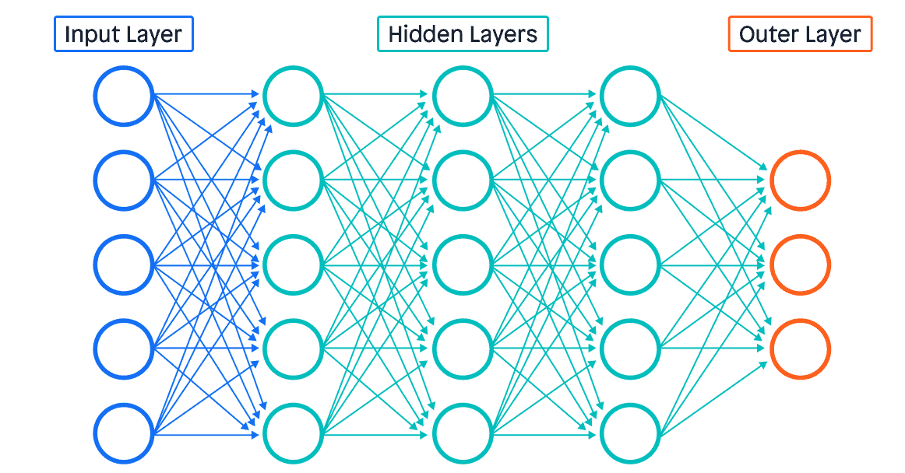

# Gen AI

# 1 What is Artificial Intelligence (AI)?

AI, or Artificial Intelligence, is a branch of computer science that focuses on creating systems that can perform tasks that would normally require human levels of intelligence. This includes things like understanding natural language, recognizing patterns, making decisions, and learning from experience.

Artificial Intelligence (AI) refers to the simulation of human intelligence in machines which helps in allowing them to think and act like humans. It involves creating algorithms and systems that can perform tasks which requiring human abilities such as visual perception, speech recognition, decision-making and language translation.

# What are the different types of artificial intelligence?

 ## By Capability:
 AI can be categorized into three levels based on its capabilities:
 
 ### Narrow AI (Weak AI):
 Also known as Artificial Narrow Intelligence (ANI), Narrow AI is designed and trained to perform a specific task. It operates under a limited pre-defined set of conditions and doesn't possess the broad range of capabilities that humans have. .

 ### General AI (Strong AI):
 Also known as Artificial General Intelligence (AGI). An AI with AGI possesses the ability to understand, learn, adapt, and implement knowledge across a wide range of tasks at a human level. While large language models and tools such as ChatGPT have shown the ability to generalize across many tasks—as of early 2025, this is still a theoretical concept, although one that is certainly gaining more traction. This is also called as 

 ### Super AI: 
 Also known as Artificial Super Intelligence (ASI), The final level of AI, ASI, refers to a future scenario where AI surpasses human intelligence in nearly all economically valuable work. This concept, while intriguing, remains largely speculative.
 
 ## By Functionality:

 ### Reactive machines
 These are the most basic forms of AI, designed to perform specific tasks. For example, IBM's Deep Blue, a chess-playing supercomputer, falls under this category. Reactive machines cannot store memories or use past experiences to inform current decisions.
 
 ### Limited memory
 Limited Memory AI can store past data and use it to make better predictions or decisions. This type of AI is commonly found in recommendation systems like those used by Netflix or Amazon.
 
 ### Theory of mind
 This is a theoretical concept that refers to AI systems potentially understanding human emotions, beliefs, and thoughts. While intriguing, we have yet to achieve this level of AI sophistication.
 
 ### Self-awareness
 The pinnacle of AI development would be self-aware machines that understand their existence and can make decisions based on self-interest. This remains a subject of ongoing research and ethical debate.
 
 ## By Technology:
 
 Specialised domains of Artificial Intelligence
 

 ### Generative AI
 Generative AI, often referred to as Gen AI, is an emerging field within AI that creates new content such as text, images, voice, video, and code by learning from data patterns. Notable examples include ChatGPT and Google's Bard.
 
 ### Machine Learning (ML)
 Machine learning (ML) is a subset of AI that allows computers to autonomously learn and improve without being explicitly programmed. ML algorithms are trained on data to make predictions or decisions.
 
 ### Natural Language Processing (NLP)
 Natural language processing (NLP) is a field of artificial intelligence (AI) that deals with the ability of computer systems to understand and generate human language. NLP algorithms are used to analyse text, comprehend, converse with users and perform tasks like language translation, sentiment analysis, and question answering. 
 
 ### Computer Vision (CV)
 Computer Vision (CV) empowers computers to 'see' and comprehend the visual world, analysing images and videos like humans. CV algorithms analyse images and videos for tasks like object detection, face recognition, and self-driving cars.

# References:

- https://www.datacamp.com/blog/how-to-learn-ai
- https://www.gosearch.ai/blog/breakdown-of-different-ai-types-and-models/
- https://www.geeksforgeeks.org/artificial-intelligence/types-of-artificial-intelligence/
- https://www.digital.nsw.gov.au/policy/artificial-intelligence/a-common-understanding-simplified-ai-definitions-from-leading

# 2 Machine Learning

## What is Machine Learning?

**Machine Learning (ML)** is a subset of artificial intelligence (AI) that enables computers to learn from data and improve their performance on tasks without being explicitly programmed. Instead of following strict rules, ML systems identify patterns in data and use these patterns to make predictions or decisions.

## How Does Machine Learning Work?

Machine learning involves feeding large amounts of data into algorithms, which then build mathematical models based on this data. These models can then be used to make predictions or classify new data.

## Types of Machine Learning

1. **Supervised Learning**
   - The algorithm is trained on labeled data (data with known answers).
   - Example: Email spam detection, where emails are labeled as "spam" or "not spam".

2. **Unsupervised Learning**
   - The algorithm finds patterns in unlabeled data (data without explicit answers).
   - Example: Customer segmentation in marketing.

3. **Reinforcement Learning**
   - The algorithm learns by interacting with an environment and receiving feedback (rewards or penalties).
   - Example: Training a robot to walk or an AI to play chess.

## Common Applications

- Image and speech recognition
- Recommendation systems (e.g., Netflix, Amazon)
- Fraud detection
- Self-driving cars
- Language translation

## Popular Machine Learning Algorithms

- Neural Networks
- Linear Regression
- Decision Trees
- Support Vector Machines (SVM)
- K-Means Clustering

# 3 Deep Learning

**Deep Learning** is a specialized subset of machine learning that uses Artificial Neural Networks (ANN) with many layers (hence "deep") to model and solve complex problems. Inspired by the structure and function of the human brain, deep learning algorithms can automatically learn representations from large amounts of data.

### How Deep Learning Works

Deep learning models are built using layers of interconnected nodes (neurons). Each layer extracts increasingly abstract features from the input data. The most common type of deep learning model is the **Artificial Neural Network** (ANN), especially the **Deep Neural Network** (DNN).

- **Input Layer:** Receives raw data (e.g., images, text, audio).
- **Hidden Layers:** Multiple layers that transform the input into more complex features.
- **Output Layer:** Produces the final prediction or classification.

### Applications of Deep Learning

- Image and speech recognition
- Natural language processing (translation, summarization)
- Autonomous vehicles (object detection, lane detection)
- Medical diagnosis (analyzing scans and images)
- Generative AI (creating text, images, music)

# 3 Generative AI

**Generative AI** refers to artificial intelligence systems that can create new content—such as text, images, audio, video, or code—by learning patterns from existing data. Unlike traditional AI models that focus on classification or prediction, generative AI models are designed to generate original data that resembles the data they were trained on.

The most common types you’ll come across are generative adversarial networks (GANs) and large language models (LLMs).

### How Generative AI Works

Generative AI models learn the underlying structure of training data and use this knowledge to produce new, similar data. They often use deep learning architectures, such as neural networks, to capture complex patterns and relationships.

### Key Types of Generative AI Models

- **Convolutional Neural Networks (CNNs):** Excellent for image and video analysis.
- **Recurrent Neural Networks (RNNs):** Designed for sequential data like time series and natural language.

- **Generative Adversarial Networks (GANs):**
  - Consist of two neural networks (generator and discriminator) that compete with each other.
  - Used for generating realistic images, videos, and audio.
  - Example: StyleGAN for high-quality image synthesis.

- **Variational Autoencoders (VAEs):**
  - Encode input data into a compressed representation and then decode it back to generate new data.
  - Commonly used for image generation and anomaly detection.

- **Transformers:**
  - Powerful models for generating text, code, and even images.
  - Examples: GPT (text generation), DALL-E (text-to-image), and Stable Diffusion (image generation).

### Types of Generative AI (GenAI) Models

### 1. Text Generation Models
- **Examples:** GPT (OpenAI), BERT, T5 (Google), LLaMA (Meta), Claude (Anthropic), Gemini (Google), Mistral, Cohere, Command R (Cohere)
- **Use Cases:** Chatbots, content writing, code generation, summarization, translation, question answering (Q&A)
- **Architecture:** Transformer-based (especially decoder-only for generation, like GPT)

### 2. Image Generation Models
- **Examples:** DALL·E (OpenAI), Midjourney, Stable Diffusion, Imagen (Google), Kandinsky
- **Use Cases:** AI art, product design, ad creatives, concept visualization
- **Architecture:** Diffusion models, GANs (Generative Adversarial Networks), Vision Transformers

### 3. Audio Generation Models
- **Examples:** Jukebox (OpenAI), MusicLM (Google), ElevenLabs, Bark (Sunno), AudioCraft (Meta)
- **Use Cases:** Music generation, voice cloning, podcasting, audio dubbing

### 4. Video Generation Models
- **Examples:** Sora (OpenAI), Runway Gen-2, Pika Labs, Lumiere (Google)
- **Use Cases:** Animation, storytelling, simulation, video ads
- **Architecture:** Video diffusion models, Transformer-based architectures

### 5. Code Generation Models
- **Examples:** Codex (OpenAI), Code LLaMA (Meta), CodeGen, DeepSeek-Coder, StarCoder
- **Use Cases:** Auto code completion, bug fixes, code explanation, test generation
- **Architecture:** Fine-tuned LLMs on large code datasets

### Applications of Generative AI

- Content creation (articles, stories, code)
- Image and video synthesis
- Art and design
- Music composition
- Data augmentation for training other AI models

Generative AI is rapidly advancing and is at the core of many creative and innovative AI applications today.

## Popular Open-Source AI Models

Below are some widely used open-source AI models, each excelling in different domains:

### 1. **TensorFlow and Keras Models**
- **Domain:** General machine learning and deep learning
- **Details:** TensorFlow (by Google) and its high-level API Keras provide a wide range of pre-trained models for image classification, object detection, text processing, and more.
- **Example Models:** MobileNet, ResNet, BERT

### 2. **PyTorch Hub Models**
- **Domain:** General deep learning
- **Details:** PyTorch (by Meta) offers a model hub with pre-trained models for vision, NLP, and audio tasks.
- **Example Models:** YOLOv5 (object detection), GPT-2 (language generation), DeepLabV3 (image segmentation)

### 3. **Hugging Face Transformers**
- **Domain:** Natural Language Processing (NLP)
- **Details:** The Hugging Face Transformers library provides state-of-the-art models for text classification, translation, summarization, and more.
- **Example Models:** BERT, GPT-2, T5, RoBERTa

### 4. **Stable Diffusion**
- **Domain:** Generative AI (text-to-image)
- **Details:** Stable Diffusion is an open-source model for generating images from text prompts, widely used for creative and design tasks.

### 5. **OpenCV Models**
- **Domain:** Computer Vision
- **Details:** OpenCV provides pre-trained models for face detection, object tracking, and image processing.

### 6. **Detectron2**
- **Domain:** Computer Vision (object detection and segmentation)
- **Details:** Developed by Meta AI, Detectron2 is a popular library for high-quality object detection and segmentation tasks.

### 7. **Whisper**
- **Domain:** Speech Recognition
- **Details:** Whisper by OpenAI is an open-source automatic speech recognition (ASR) model that supports multiple languages.
