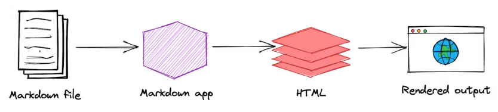

# What is Markdown?

Markdown was developed by John Gruber in 2004. It is designed to provide a simple, readable syntax that can be easily converted to HTML and various other formats.

# How Does it Work?
Markdown files are converted to HTML using a Markdown application, which contains a processor (or parser). This processor reads the Markdown-formatted text from a plain text file (with a .md or .markdown extension) and transforms it into HTML. The resulting HTML can then be viewed in a web browser or styled and printed.



# HTML Elements

Markdown is a superset of HTML, so any HTML file is valid Markdown.

`<!-- This means we can use HTML elements in Markdown, such as the comment element, and they won't be affected by a markdown parser. However, if you create an HTML element in your markdown file, you cannot use markdown syntax within that element's contents. -->`

# Headings

To create a heading, add number sign `#` in front of a word or phrase. 

```
# Heading level 1
## Heading level 2
### Heading level 3
#### Heading level 4
##### Heading level 5
###### Heading level 6
```

# Heading level 1
## Heading level 2
### Heading level 3
#### Heading level 4
##### Heading level 5
###### Heading level 6

Alternatively, on the line below the text, add any number of `==` characters for heading level 1 or `--` characters for heading level 2.

```
Heading level 1
===============
```

```
Heading level 2
---------------
```

# Paragraphs
Paragraphs are the default in Markdown - just type your text and it becomes a paragraph. To start a new paragraph, leave a blank line between blocks of text. To add a line break within a paragraph, end the line with two spaces.

This is a paragraph.
  
Since there is a new line between these two sentences they will be converted to two separate paragraphs.

This paragraph
has new lines in it
but
it will not show up as a new line in the output.

This paragraph
has two spaces HERE  
so it will push this onto a new line within the same paragraph.

# Line Breaks

To create a line break or new line (`<br>`), end a line with two or more spaces, and then type return.

# Text Styling

| Style                  | Syntax                      | Example                                         | Output                                 |
|------------------------|-----------------------------|-------------------------------------------------|----------------------------------------|
| Bold                   | `** **` or `__ __`          | `**This is bold text**`                         | **This is bold text**                  |
| Italic                 | `* *` or `_ _`              | `_This text is italicized_`                     | _This text is italicized_              |
| Bold and nested italic | `** **` and `_ _`           | `**This text is _extremely_ important**`        | **This text is _extremely_ important** |
| All bold and italic    | `*** ***`                   | `***All this text is important***`              | ***All this text is important***       |
| Strikethrough          | `~~ ~~`                     | `~~This was mistaken text~~`                    | ~~This was mistaken text~~             |
| Subscript              | `<sub> </sub>`              | `This is a <sub>subscript</sub> text`           | This is a <sub>subscript</sub> text    |
| Superscript            | `<sup> </sup>`              | `This is a <sup>superscript</sup> text`         | This is a <sup>superscript</sup> text  |
| Underline              | `<ins> </ins>`              | `This is an <ins>underlined</ins> text`         | This is an <ins>underlined</ins> text  |

# Emoji

The last extended Markdown feature we will cover is ading emojis. To add an emoji you can just type :EMOJI_NAME: and it will be converted to an emoji. This feature is much less widely supported than some of the other extended Markdown features covered up to this point and does not work with GitHub Flavored Markdown, but you can just copy the emoji into your Markdown and it will work.

:smile:

# Highlight
Another extended Markdown feature is highlighting text. To highlight text you can wrap your text in two = characters. Unfortunately, GitHub Flavored Markdown does not support this feature so it will not work in the editor below, but you can use HTML within Markdown (sometimes) so I also included the HTML version of this feature.

==Highlighted==

<mark>Highlighted</mark>

# Blockquotes

You can quote text with a >

`> This is a blockquote`

`>> This is a nested blockquote`

> This is a blockquote
>> This is a nested blockquote  
  

# Horizontal Rule
To add a horizontal rule you can add three or more -, _, or * characters on a single line.

This text is above the horizontal rule

***

This text is between the horizontal rules

---

This text is between the horizontal rules

___

This text is below the horizontal rule

# Lists

## Ordered Lists
To create an ordered list, add line items with numbers followed by periods. The numbers don’t have to be in numerical order, but the list should start with the number one.

```
1. First item
2. Second item
3. Third item
4. Fourth item
```

```
1. First item
1. Second item
1. Third item
1. Fourth item
```

```
1. First item
8. Second item
3. Third item
5. Fourth item
```

```
1. First item
2. Second item
3. Third item
    1. Indented item
    2. Indented item
4. Fourth item
```

## Unordered Lists

To create an unordered list, add dashes (-), asterisks (*), or plus signs (+) in front of line items. Indent one or more items to create a nested list.

```
- First item
- Second item
- Third item
- Fourth item
```

OR 

```
* First item
* Second item
* Third item
* Fourth item
```

OR 

```
+ First item
+ Second item
+ Third item
+ Fourth item
```

OR 

```
- First item
- Second item
- Third item
    - Indented item
    - Indented item
- Fourth item
```

# Handling Code

## Inline Code
To display code inline you can wrap your code in a single ` character. This is useful for displaying small snippets of code within a paragraph.

``This is `inline code` within a paragraph.``

This is `inline code` within a paragraph.

## Code Blocks

To display a larger block of code you can wrap your code in three ``` characters. You can also specify the language of your code block by adding the language name after the three characters. This will add syntax highlighting to your code block. This is an extended feature of Markdown, but nearly every Markdown flavor supports it.

```js
// This is a code block
const a = 1;
```

# Links

To create a link you can wrap your text in square brackets and then wrap the link in parentheses. You can even do this to make relative links. Also, if you include a URL on its own it will automatically be converted to a link in some extended Markdown flavors, otherwise you can wrap it in to make it a link.

`My favorite search engine is [Duck Duck Go](https://duckduckgo.com "The best search engine for privacy").`  
My favorite search engine is [Duck Duck Go](https://duckduckgo.com "The best search engine for privacy").

`[This is a link](https://blog.webdevsimplified.com)`  
[This is a link](https://blog.webdevsimplified.com)

`[This is a relative link](/blog/2025-08-08-first-post)`  

`https://blog.webdevsimplified.com`  
https://blog.webdevsimplified.com

`<https://blog.webdevsimplified.com>`  
[webdevsimplified](https://blog.webdevsimplified.com)


# Custom anchors

## Section Heading

Some body text of this section.

<a name="my-custom-anchor-point">hello</a>
Some text I want to provide a direct link to, but which doesn't have its own heading.

(… more content…)

[A link to that custom anchor](# Images)

# Images
Images look very similar to links since they are also wrapped in square brackets and parentheses. The only difference is that you need to add an exclamation mark before the square brackets. Also, the text in the square brackets is used as the alt text for the image while the link in the parentheses is used as the source for the image.

``


# Task lists or Checklist

The last element we will cover is the checklist. This is an extended Markdown feature, but it is supported by GitHub Flavored Markdown. To create a checklist you can add a - [ ] or - [x] before each item in your list. The - [ ] will create an unchecked checkbox while the - [x] will create a checked checkbox.

- [ ] Unchecked
- [x] Checked

- [x] #739
- [ ] https://github.com/octo-org/octo-repo/issues/740
- [ ] Add delight to the experience when all tasks are complete :tada:

# Footnotes

You can add footnotes to your content by using this bracket syntax:

Here is a simple footnote[^1].

A footnote can also have multiple lines[^2].

[^1]: My reference.
[^2]: To add line breaks within a footnote, prefix new lines with 2 spaces.
  This is a second line.

# Alerts

> [!NOTE]
> Useful information that users should know, even when skimming content.

> [!TIP]
> Helpful advice for doing things better or more easily.

> [!IMPORTANT]
> Key information users need to know to achieve their goal.

> [!WARNING]
> Urgent info that needs immediate user attention to avoid problems.

> [!CAUTION]
> Advises about risks or negative outcomes of certain actions.

# Hiding content with comments
`<!-- This content will not appear in the rendered Markdown -->`

# Ignoring Markdown formatting
You can tell GitHub to ignore (or escape) Markdown formatting by using \ before the Markdown character.

Let's rename \*our-new-project\* to \*our-old-project\*.

# Languages

```jsx showLineNumbers {1,4-6,11}
import React from 'react';

function MyComponent(props) {
  if (props.isBar) {
    return <div>Bar</div>;
  }

  return <div>Foo</div>;
}

export default MyComponent;
```


# References

* [John Gruber’s Markdown documentation](https://daringfireball.net/projects/markdown/) - The original guide written by the creator of Markdown.
* [Markdown Tutorial](https://www.markdowntutorial.com/) - An open source website that allows you to try Markdown in your web browser.
* [Awesome Markdown](https://github.com/mundimark/awesome-markdown) - A list of Markdown tools and learning resources.
* [Typesetting Markdown](https://dave.autonoma.ca/blog/2019/05/22/typesetting-markdown-part-1/) - A multi-part series that describes an ecosystem for typesetting Markdown documents using pandoc and ConTeXt.
* [Markdown Guide](https://www.markdownguide.org/) - Markdown guide