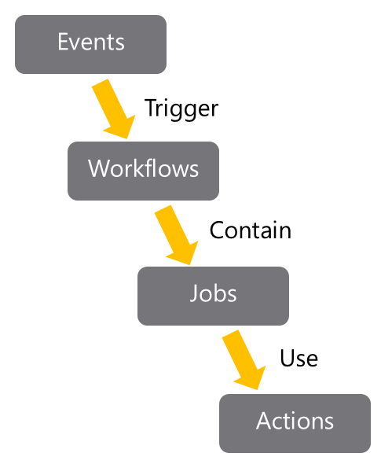

# Introduction

GitHub Actions are the primary mechanism for automation within GitHub.

They can be used for a wide variety of purposes, but one of the most common is to implement Continuous Integration.

Github Actions is a Continuous Integration and Continuous Delivery (CI/CD) platform that automates the build, test and deployment pipelines and are packaged scripts to automate tasks in a software development workflow in GitHub.

- Explain GitHub Actions and workflows.
- Create and work with GitHub Actions and Workflows.
- Describe Events, Jobs, and Runners.
- Examine the output and release management for actions.
- https://docs.github.com/en/actions
- https://docs.github.com/en/actions/get-started/understand-github-actions
- https://docs.github.com/en/actions/get-started/quickstart
- https://docs.github.com/en/actions/tutorials

# What are actions?

Actions are the mechanism used to provide workflow automation within the GitHub environment.

They're often used to build continuous integration (CI) and continuous deployment (CD) solutions.

However, they can be used for a wide variety of tasks:

Automated testing.
Automatically responding to new issues, mentions.
Triggering code reviews.
Handling pull requests.
Branch management.
They're defined in YAML and stay within GitHub repositories.

Actions are executed on "runners," either hosted by GitHub or self-hosted.

# Actions flow

GitHub tracks events that occur. Events can trigger the start of workflows.

Workflows can also start on cron-based schedules and can be triggered by events outside of GitHub.

They can be manually triggered.

Workflows are the unit of automation. They contain Jobs.

Jobs use Actions to get work done.

# workflow syntax

Workflows include several standard syntax elements.

https://docs.github.com/en/actions/reference/workflows-and-actions/workflow-syntax

Name: is the name of the workflow. It's optional but is highly recommended. It appears in several places within the GitHub UI.
On: is the event or list of events that will trigger the workflow.
Jobs: is the list of jobs to be executed. Workflows can contain one or more jobs.
Runs-on: tells Actions which runner to use.
Steps: It's the list of steps for the job. Steps within a job execute on the same runner.
Uses: tells Actions, which predefined action needs to be retrieved. For example, you might have an action that installs node.js.
Run: tells the job to execute a command on the runner. For example, you might execute an NPM command.
