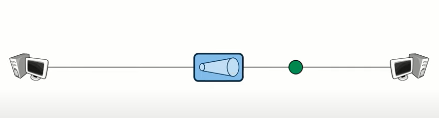
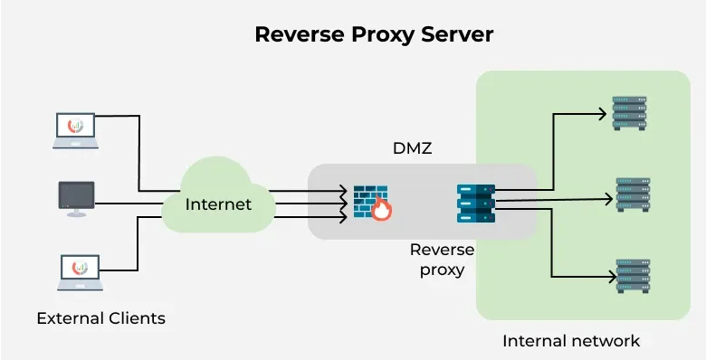

# Network Devices

Let's discover **Network Devices in less than 5 minutes**.

- Host
- IP Address
- Network
- Repeater
- Hub
- Bridge
- Switch
- Router

### Host
- A **host** is any device that sends or receives data over  a network. 
- Examples include computers, smartphones, printers, servers etc.
- Hosts are usually classified as clients (which make requests) or servers (which respond to requests).
- Servers are simply computers with software installed which responds to specific requests

### IP Address
- **IP Address** (Internet Protocol Address) is a unique identifier assigned to each host, like phone number.  

- It allows devices to locate and communicate with each other. 
- There are IPv4 (e.g., 192.168.1.1) and IPv6 (e.g., 2001:0db8::1) formats.
- IPv4 are 32 bits, Bit = 0 or 1
- IPv4 represented as 4 Octets
- [0-255].[0-255].[0-255].[0-255]
- IPv4s are hierarchally assigned (known as subnetting)

### Network
- A **network** is what transports traffic between Hosts.
- It is a collection of interconnected devices (hosts) that can communicate and share resources. 
- Networks can contain other networks, sometimes called **Sub-Networks** or **Subnets**
- Networks can be local (LAN), wide-area (WAN), or even global (Internet).
- Internet is simply a bunch of interconnected networks. 
- ISPs handles these connections.
- Tx: Transmitting Data and Rx: Receiving Data 

### Repeater
A **repeater** operates at the physical layer. Its main function is to amplify (i.e., regenerate) the signal over the same network before the signal becomes too weak or corrupted to extend the length to which the signal can be transmitted over the same network. When the signal becomes weak, they copy it bit by bit and regenerate it at its star topology connectors connecting following the original strength. It is a 2-port device.

### Hub
A hub is a multiport repeater. A hub connects multiple wires coming from different branches, for example, the connector in star topology which connects different stations. Hubs cannot filter data, so data packets are sent to all connected devices. 

A **hub** is a basic networking device that connects multiple devices in a network. It broadcasts incoming data to all connected devices, regardless of the destination. Hubs operate at Layer 1 (Physical Layer) of the OSI model.

### Bridge
A **bridge** connects and filters traffic between two or more network segments, making them function as a single network. Bridges operate at Layer 2 (Data Link Layer) and help reduce network collisions.

### Switch
A **switch** is a device that connects multiple devices within a network and forwards data only to the specific device it is intended for. Switches operate at Layer 2 and are more efficient than hubs.

### Router
A **router** connects different networks together and directs data packets between them. Routers operate at Layer 3 (Network Layer) and determine the best path for data to travel across networks, such as between your home network and the Internet.

[difference-between-hub-switch-and-router](https://www.geeksforgeeks.org/computer-networks/difference-between-hub-switch-and-router/)

### Reverse proxy
A reverse proxy is important to make sure everything keeps on running securely and smoothly. A reverse proxy is a server that exists between your website visitors and your real web server. Rather than accessing the backend directly, users access it through this middle stage. It's similar to an intelligent traffic controller for your web traffic—routing requests where they need to go, accelerating things, and blocking danger.

Famous software such as Nginx, Apache, and HAProxy simplify setting one up on Linux or cloud infrastructure greatly.

A reverse proxy is a type of server that acts as a middle layer between the user (like someone visiting a website) and the actual web server where the content lives. Instead of users accessing your backend servers directly, all incoming requests first go through the reverse proxy. It then decides which server should handle the request and forwards it accordingly.

Reverse proxies help websites and apps perform better, stay secure, and manage more users at once. They also protect real server IPs, handle traffic spikes, and help balance the load across multiple servers.

[what-is-a-reverse-proxy](https://www.geeksforgeeks.org/computer-networks/what-is-a-reverse-proxy/)

[difference-between-forward-proxy-and-reverse-proxy](https://www.geeksforgeeks.org/system-design/difference-between-forward-proxy-and-reverse-proxy/)